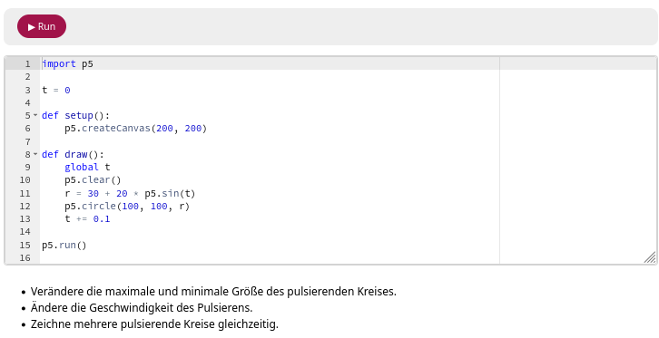
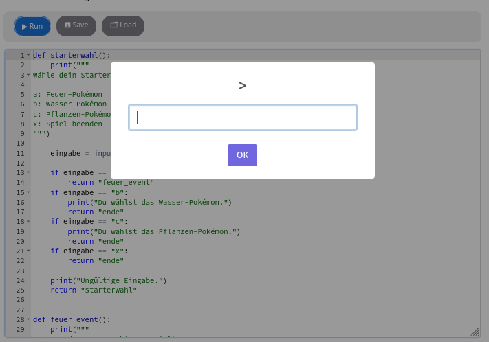
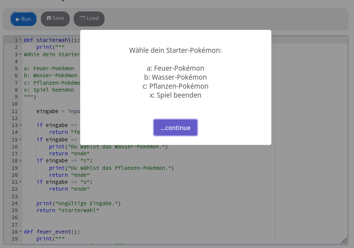
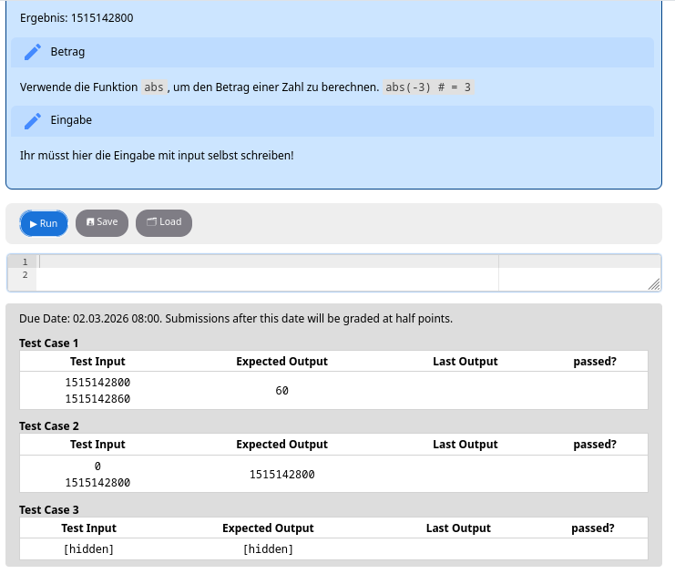
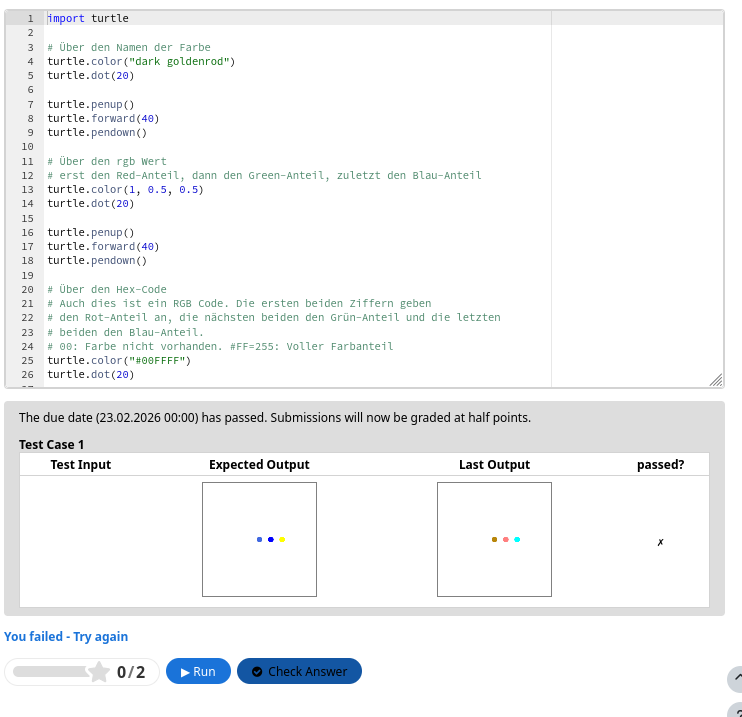

# H5P Python Question Type

A custom H5P content type that provides an interactive Python programming environment for learning and assessment.  
It allows educators to create coding assignments, interactive explanations, and auto-graded exercises directly inside H5P.

## Features

- Interactive Python IDE inside H5P
- Markdown-based learning pages with embedded code editors
- Automatic validation using input/output test cases oder image-comparison
- Turtle graphics support and p5 graphics support
- Designed for programming education
- Browser-based execution (no server required)

## Use Cases

- Programming exercises for students
- Interactive Python tutorials
- Coding assignments with automatic grading
- Teaching algorithmic thinking
- Self-paced learning modules
- Demonstrations and live coding explanations

## How It Works

This content type integrates:

- **Skulpt** → Python execution in the browser
- **Ace Editor** → code editing interface

Student code runs directly in the browser and can be validated using predefined test cases.

## Examples:

### Interactive Examples

See: [Part of actual programming course (Language: German)](https://www.opencoding.de/course/view.php?id=12)

### p5 Graphics

### Input and output vs popups

### Input/Output Testcases

### Image Comparison Testcases with turtle graphics

