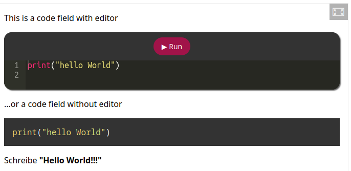
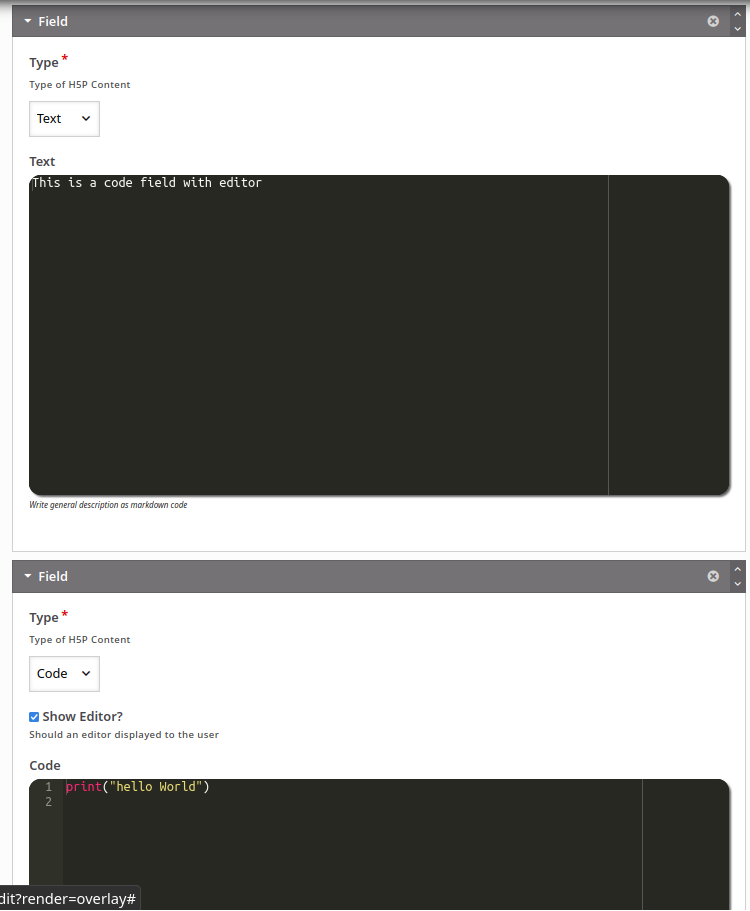
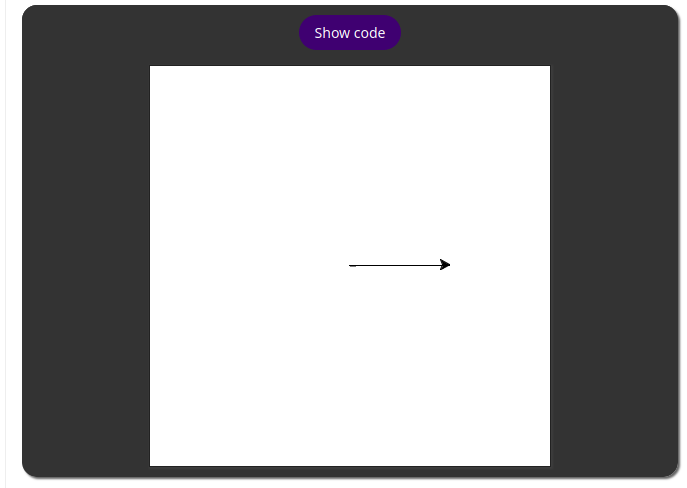

H5P-content-python-ide
=====================

Python Question Type for H5P (Hint: Beta Status)

## Description

This H5P content type provides a Python question type based on Skulpt and the Ace editor.

The question type offers two different possibilities: 

* Text pages can be created markdown with interactive editors.
* An IDE can be provided with which coding assignments can be made available to students. Students' programmes can be checked with input/output test cases. 

## Screenshots

Interaktive Textfields

Turtle Graphics

Assignments

## Video

* [Demo (German Language)](https://www.youtube.com/watch?v=Kb346xXr7f8&feature=youtu.be)

## Based on

 * [H5P-content-code-question](https://codeberg.org/a_siebel/h5p-content-code-question)
 * [H5P-editor-code-widget](https://codeberg.org/a_siebel/h5p-editor-code-widget)
 * [H5P-lib-code-tools](https://codeberg.org/a_siebel/h5p-lib-code-tools)