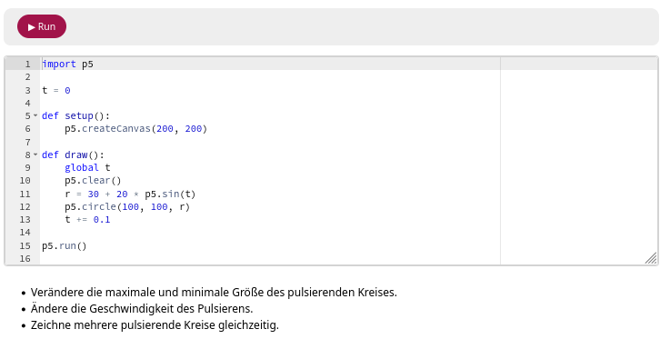
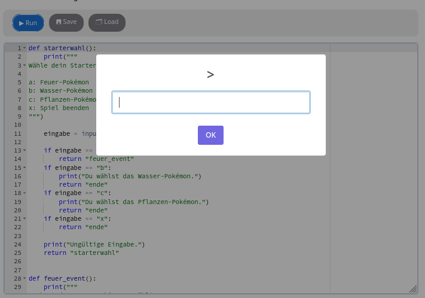
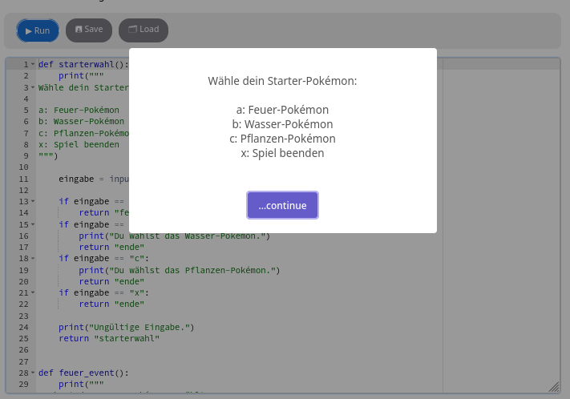
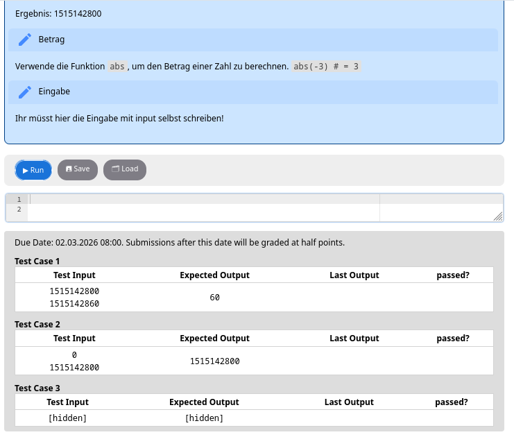
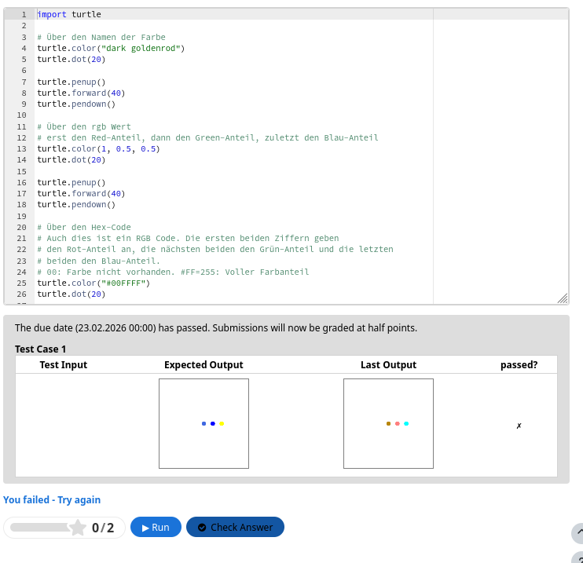

# H5P Python Question Type

A custom H5P content type that provides an interactive Python programming environment for learning and assessment.  
It allows educators to create coding assignments, interactive explanations, and auto-graded exercises directly inside H5P.

## Features

- Interactive Python IDE inside H5P
- Markdown-based learning pages with embedded code editors
- Automatic validation using input/output test cases oder image-comparison
- Turtle graphics support and p5 graphics support
- Designed for programming education
- Browser-based execution (no server required)

## Use Cases

- Programming exercises for students
- Interactive Python tutorials
- Coding assignments with automatic grading
- Self-paced learning modules
- Demonstrations and live coding explanations

## How It Works

This content type integrates:

- **Skulpt** and **Pyodide** → Python execution in the browser
- **Codemirror-Editor** → code editing interface

Student code runs directly in the browser and can be validated using predefined test cases.

## Hosted Skulpt Runtime

Skulpt is not bundled in this H5P library. By default it is loaded from the p5-capable Skulpt build maintained in `StriveMath/p5-python-web`:

- Default: `https://cdn.jsdelivr.net/gh/StriveMath/p5-python-web@0.0.15/lib/skulpt.min.js`
- Alternative CDN: `https://rawcdn.githack.com/StriveMath/p5-python-web/0.0.15/lib/skulpt.min.js`
- Official Skulpt without p5 fork changes: `https://cdn.jsdelivr.net/npm/skulpt@1.2.0/dist/skulpt.min.js`

The advanced `Skulpt Script URL` setting accepts either a base directory or a direct `skulpt.min.js` URL. The matching `skulpt-stdlib.js` file is loaded from the same directory.

`p5-python-web` also ships a combined `dist/p5-python-web.js`, but this H5P integration intentionally uses the separate `lib/skulpt.min.js` and `lib/skulpt-stdlib.js` files so the existing Skulpt loader and runtime setup stay in control.

## Examples:

### Interactive Examples

See: [Showcase](https://www.opencoding.de/course/view.php?id=2) (german only)

### p5 Graphics

### Input and output vs popups

### Input/Output Testcases

### Image Comparison Testcases with turtle graphics

